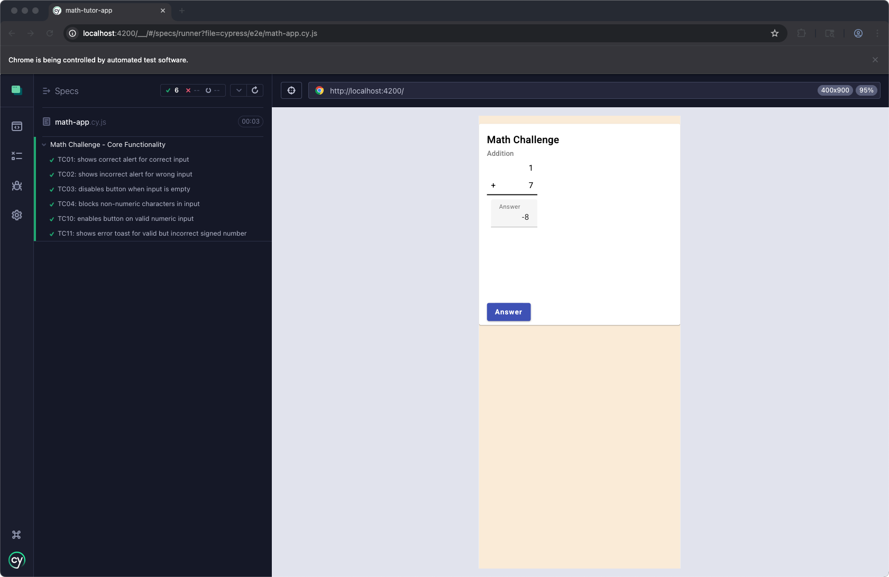
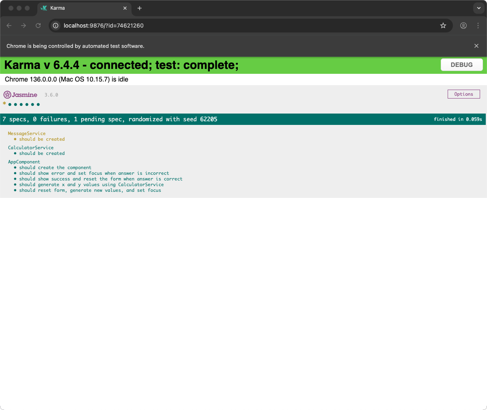

# OneCause QA Take-Home

### Erik Anderson – Formal Walkthrough

---

## 📋 Project Overview

- Repo: `math-tutor-app`
- Stack: Angular, Jasmine, Cypress
- Goal: Validate math addition logic, ensure frontend test coverage
- Focus: Core functionality QA, test scaffolding, CI-ready hygiene

---

## 🧪 Testing Strategy

- **Unit Tests (Jasmine + Karma)**
  - Logic validation for `AppComponent`
  - DI mocking with service isolation
- **End-to-End (Cypress)**
  - User input to feedback flow
  - Data-testid based selectors
- **Manual Testing**
  - Exploratory UX validation
  - Input edge cases, passive validation

---

## 🧱 Unit Test Coverage (AppComponent)

- Component creation ✅
- `checkAnswer()`
  - ✔️ Correct → show success + reset form
  - ❌ Incorrect → show error + set focus
- `resetForm()`
  - Clears input, regenerates values, restores focus
- `generateXandY()`
  - Uses `CalculatorService.generateNumber()` ×2

---

## 🧩 DI and Mocking

- Used Jasmine spies to isolate:
  - `CalculatorService`
  - `MessageService`
- Avoided toast injection issues by mocking instead of wiring full `ToastrModule`
- Prevented global type leaks between Cypress and Jasmine via tsconfig splitting

---

## 🛠️ Test Plan and Change Tracking

- `test-plan.md` includes:
  - Scope definitions
  - Tool mapping
  - Deferred test strategy for `MessageService`
- `CHANGELOG.md` updated with v0.3.0:
  - Unit test work
  - Infra refactor
  - Documentation update

---

## 🧪 Cypress Tests (Core Functionality)

- Success + error validation (TC01–TC04)
- Disabled field + non-numeric input (TC03–TC04)
- Fixture-based toast messages
- Selector strategy: `data-testid`

---

## ✅ Cypress E2E Test Proof

### Core Functionality:

- TC01–TC04: Alert validation & input control
- TC10–TC11: Validity + signed number behavior
- All tests passing ✅

---

## ✅ Jasmine Unit Test Proof

### AppComponent Coverage:

- checkAnswer() (✓/✗ paths)
- resetForm()
- generateXandY()
- DI mocks for services
- All specs green ✅

---

## ✅ Deliverables Summary

- [x] Unit test suite (Jasmine)
- [x] Cypress spec (core functionality)
- [x] `test-plan.md`, `test-cases.md`, `README.md`
- [x] CHANGELOG (0.3.0)
- [x] Marp presentation (this doc)
- [ ] Final repo audit / PR

---

## 👨‍💻 Final Notes

- CI-oriented structure
- Clear test ownership boundaries
- Confident handoff ready

> Thank you for reviewing my take-home. Happy to dig deeper or walk through anything in detail.

---
